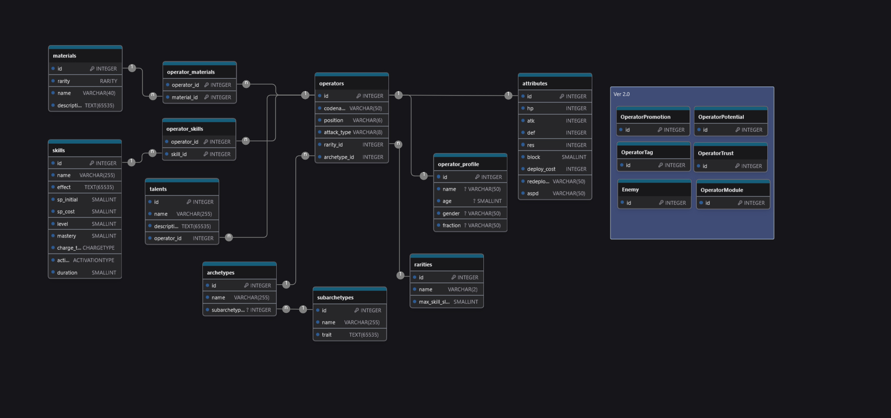

# ArkBase

*Description*

## Table of Contents

- [Prerequisites](#prerequisites)
- [Installation](#installation)
- [How to run](#how-to-run-locally)
- [Database schema](#database-schema)
- [Contributing](#contributing)

## Prerequisites

- Java LTS 21 or higher;
- PostgreSQL 16 or higher

## Installation

1. Clone the repository:

```bash
git clone https://github.com/MinoUni/ArkBase.git
```

2. Create `.env` file in project root and add environment variables:

```
DB_URL=<database-url>
DB_USERNAME=<username>
DB_PASSWORD=<password>
```

## How to run (locally)

Create `Maven` with `spring-boot:run` command configuration(if you use IDE), or:

```bash
./mvnw spring-boot:run 
```

## Database schema



## Contributing

1. Fork the repository.
2. Create a new branch: `git checkout -b <feature-name>`.
3. Make your changes.
4. Push your branch: `git push origin <feature-name>`.
5. Create a pull request to `main` branch.